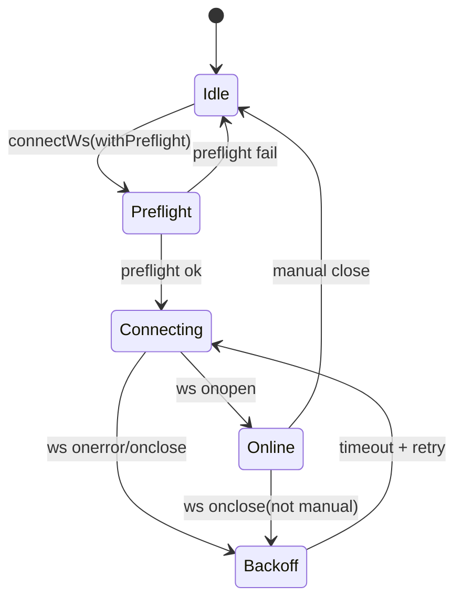
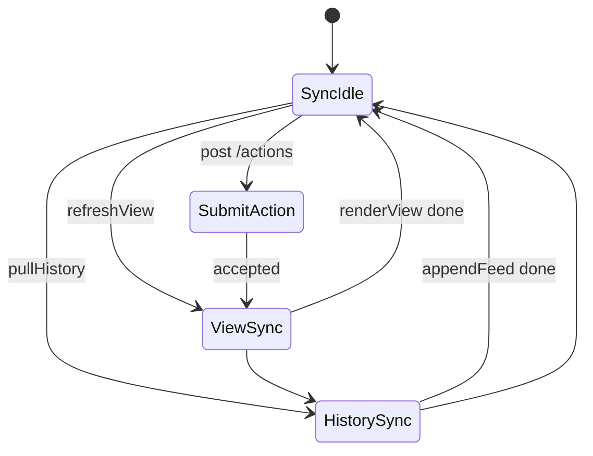
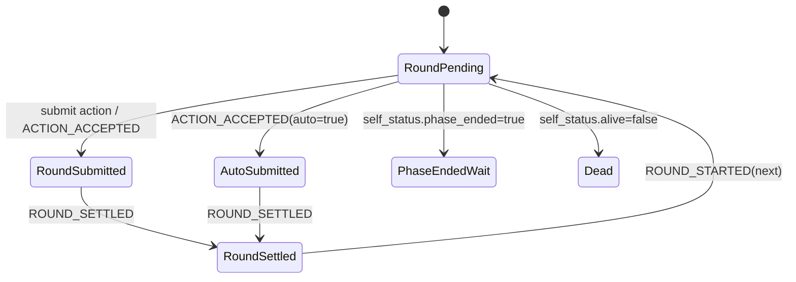
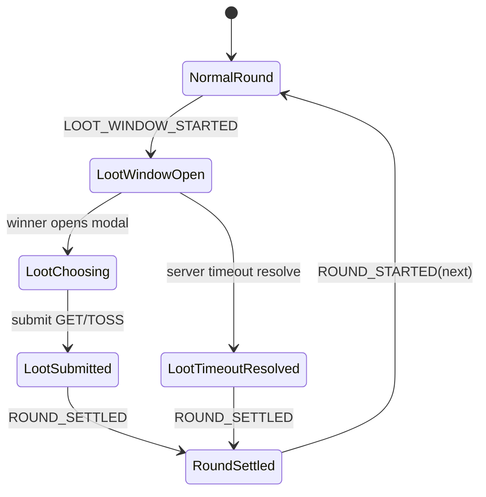
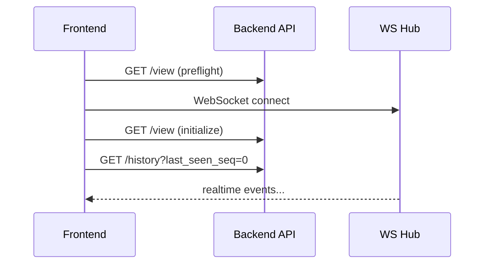
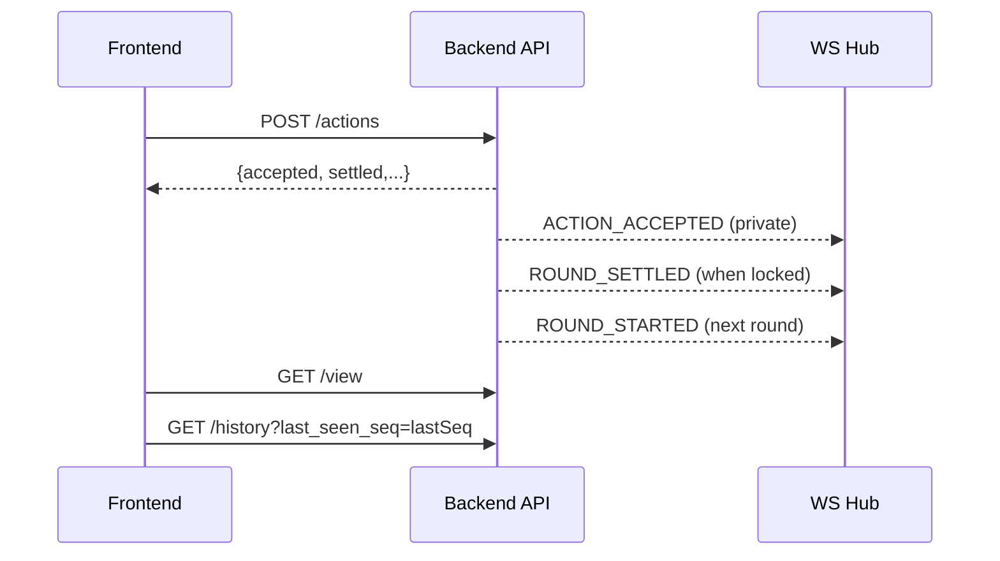
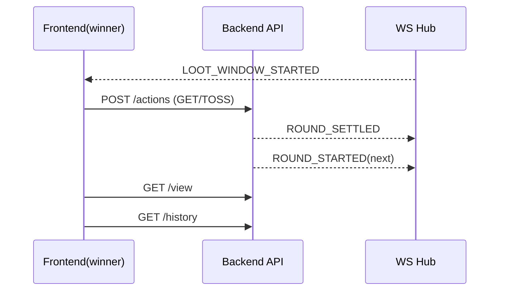

# 游戏页前端技术详细设计

## 1. 文档范围与目标

本文档描述游戏页前端（`web/game.html` + `web/assets/game.js`）的通信协议、状态管理与运行策略，覆盖以下内容：

- HTTP 请求清单与语义
- WebSocket 推送事件与消费策略
- HTTP 与 WebSocket 的关系、影响与一致性保障
- 前端状态机设计（连接、同步、回合、战利品窗口）
- 轮询/定时/重连策略
- 关键技术细节、异常处理与测试建议

不覆盖：大厅页（`lobby.js`）细节、后端业务规则算法细节。

---

## 2. 前端运行架构

### 2.1 模块职责

- 视图层：渲染地图、属性面板、回合提示、历史事件流、结算弹窗。
- 通信层：
  - HTTP：拉取当前状态、提交动作、手动触发控制操作。
  - WebSocket：接收实时推送事件（回合、结算、终局等）。
- 状态层：维护客户端运行态（连接态、回合态、已提交动作、历史游标、去重标记）。

### 2.2 核心状态变量（`game.js`）

- 身份与连接：
  - `roomId`, `playerId`
  - `ws`, `wsReconnectAttempt`, `wsReconnectTimer`, `wsHeartbeatTimer`
- 同步与去重：
  - `lastSeq`（history 增量游标）
  - `refreshViewInFlight`（并发请求合并）
  - `lastAutoRefreshRoundStartedKey`（同轮自动刷新去重）
  - `handledCombatMessageIds`（消息 UI 处理去重）
  - `historyBootstrapped`（首次历史拉取抑制弹窗）
- 回合交互：
  - `latestView`, `lastSubmitted`, `lastSettlement`
  - `roundPromptRoundKey`, `roundPromptDeadlineAtMs`, `roundCountdownTimer`
  - `submittedRoundKey`, `submittedActionLabel`, `submittedBySystem`
- 战斗/战利品：
  - `combatPerspective`, `combatOpponentId`

---

## 3. HTTP 接口设计（游戏页使用）

> 基础路径均为同源 API。

## 3.1 读接口

1. `GET /rooms/{room_id}/players/{player_id}/view`
- 作用：获取“当前权威玩家视图”。
- 关键字段（前端使用）：`time_state`、`position`、`self_status`、`inventory`、`allowed_actions`、`round_timer`、`loot_window`。
- 调用时机：
  - 页面初始化
  - 手动刷新
  - `ROUND_STARTED` 推送后自动刷新（同轮去重）
  - 动作提交成功后

2. `GET /rooms/{room_id}/players/{player_id}/history?last_seen_seq={n}`
- 作用：按 `server_seq` 增量拉取消息历史。
- 返回：`{ items: [...], count }`
- 调用时机：
  - 页面初始化
  - 手动拉取
  - 动作提交/控制操作后补齐事件

3. `GET /rooms/{room_id}/summary`
- 作用：获取终局摘要（也可由 `GAME_OVER` 推送触发展示）。

## 3.2 写接口

1. `POST /rooms/{room_id}/actions`
- 作用：提交动作（含核心动作与战利品动作 `GET/TOSS`）。
- 请求体：`{ player_id, action_type, payload }`
- 典型返回：
  - 成功：`{ accepted: true, settled, action_id, round_locked }`
  - 失败：`{ accepted: false, error: {...} }`
- 说明：战利品分支返回中也不再包含 `mode` 字段（旧 `mode=LOOT_WINDOW` 已移除）。

2. `POST /rooms/{room_id}/start`
- 作用：开局。
- 典型副作用：触发 `GAME_STARTED` + `ROUND_STARTED` 推送。

3. `POST /rooms/{room_id}/tick-ai`
- 作用：手动触发 AI 推进（测试/运维辅助）。
- 可能副作用：触发结算、进入战利品窗口、进入新回合。
- 典型返回：`{ ok: true, settled: false }` 或 `{ ok: true, settled: true }`（不包含 `mode` 字段）。

4. `POST /rooms/{room_id}/leave`
- 作用：离开房间。
- 请求体：`{ player_id }`

5. `POST /rooms/{room_id}/reset`
- 作用：重置房间进入下一局准备。
- 请求体：`{ player_id }`

---

## 4. WebSocket 事件设计

## 4.1 连接与保活

- 连接地址：`/ws/{room_id}/{player_id}`
- 预检：连接前调用一次 `GET /view`，失败则不发起 WS（避免无效连接）。
- 心跳：
  - 客户端每 `20s` 发送 `"ping"`
  - 服务端回复 `"pong"`
- 重连：
  - 指数退避（基础 `3s`，上限 `30s`）+ 抖动（`0~1s`）
  - `1008`（鉴权/参数不合法）不重试

## 4.2 推送消息统一模型

服务端消息（每条）包含：

- `message_id`：消息唯一标识
- `server_seq`：房间内单调递增序号
- `day / phase / round`：时间上下文
- `timestamp`
- `event_type`
- `payload`
- `private_payload`（可选，仅目标玩家可见）

## 4.3 事件类型与前端行为

1. `GAME_STARTED`
- 行为：记录事件；状态变化由后续 `ROUND_STARTED` + `/view` 同步体现。

2. `ROUND_STARTED`
- 表示新回合开始（不再承载战利品窗口语义）
- 触发一次自动 `refreshView()`（按 `day|phase|round` 去重 + 条件跳过）
- 若 `payload.round_timer` 存在，直接更新前端倒计时基准

3. `LOOT_WINDOW_STARTED`
- 战利品窗口开始，双方均收到
- 胜者弹出 `GET/TOSS` 选择；败者弹出等待窗口

4. `LOOT_WINDOW_RESOLVED`
- 战利品窗口结算结果广播给双方
- 包含 `choice/obtained`，败者可见被拿走物品

5. `ACTION_ACCEPTED`
- 行为：显示动作已受理。
- 若 `payload.auto === true`：表示系统超时代提，更新“已提交动作”提示态。

6. `ACTION_REJECTED`
- 行为：展示失败原因（错误码/错误文案）。

7. `ROUND_SETTLED`
- 行为：
  - 更新“本轮结算”面板
  - 若存在 `private_payload`，按私有结果展示动作明细与事件明细
  - 依据策略决定是否弹结算弹窗

8. `GAME_OVER`
- 行为：展示终局摘要弹窗（文本 + HTML 摘要卡片）。

---

## 5. HTTP 与 WebSocket 的关系与一致性策略

## 5.1 通道定位

- WebSocket：事件驱动通道，负责“发生了什么”。
- HTTP `/view`：状态快照通道，负责“现在是什么”。
- HTTP `/history`：补偿通道，负责“遗漏了什么”。

## 5.2 一致性原则

1. 事件先行，快照兜底  
收到关键事件（如 `ROUND_STARTED`）后拉一次 `/view`，以权威状态覆盖局部 UI 推断。

2. 动作确认后强制补齐  
`POST /actions` 成功后串行执行：
- `refreshView()`
- `pullHistory()`

避免仅依赖 WS 导致状态显示滞后或漏事件。

3. 增量游标保障断线恢复  
`lastSeq` 记录已处理最大 `server_seq`，`/history?last_seen_seq=lastSeq` 补齐断连期间消息。

4. 去重防抖  
- 同轮自动刷新去重：`lastAutoRefreshRoundStartedKey`
- 并发刷新合并：`refreshViewInFlight`
- UI 消息去重：`handledCombatMessageIds`

## 5.3 影响分析

- 仅 WS：低延迟但有断线丢消息风险。
- 仅 HTTP 轮询：一致性可控但延迟高且开销大。
- 当前混合方案：低延迟 + 可恢复性，且通过去重避免请求风暴。

---

## 6. 状态机设计

## 6.1 连接状态机

## 6.2 同步状态机（视图/历史）

## 6.3 回合交互状态机（单玩家视角）

## 6.4 战利品窗口子状态机

---

## 7. 轮询、定时与调度策略

## 7.1 前端策略

- 无固定周期 HTTP 轮询（避免持续负载）。
- 事件驱动拉取：
  - 关键事件后触发 `/view`
  - 关键操作后触发 `/history`
- 本地 UI 定时器：
  - `roundCountdownTimer` 每 `1s` 刷新倒计时文案，不访问网络。
  - `wsHeartbeatTimer` 每 `20s` ping。

## 7.2 后端推进对前端的影响

服务端存在 `active_room_tick_loop`（约 `1s` 一次）处理：
- 回合超时自动代提
- 战利品窗口超时裁决
- AI 自动提交与结算推进

因此前端即使不轮询，也会通过 WS 持续收到状态推进事件。

---

## 8. 关键技术细节与实现约束

1. `refreshView()` 并发合并  
如果已有 `/view` 请求进行中，后续调用复用同一 Promise，防止瞬时多发。

2. `ROUND_STARTED` 自动刷新同轮去重  
按 `day|phase|round` 只触发一次自动刷新，避免 WS 与 history 重放造成重复请求。

3. 首次历史拉取弹窗抑制  
`historyBootstrapped=false` 时回放历史不弹结算窗，防止“刚进页面就连弹旧消息”。

4. 消息幂等处理  
依赖 `message_id` 做 UI 侧去重，避免同一事件重复打开战斗/结算弹窗。

5. 私有结算隔离  
`ROUND_SETTLED.private_payload` 为后端按玩家隔离后的内容，前端不得跨玩家拼装。

6. 连接失败可观测  
WS 关闭码与关闭原因映射为可读状态文本，便于用户和调试定位问题。

---

## 9. 异常流与降级策略

1. `POST /actions` 返回 `accepted=false`
- 前端抛错并在提交结果区 + feed 展示失败原因。

2. WS 断开
- 自动退避重连。
- 用户仍可手动执行 `/view`、`/history` 进行状态恢复。

3. 预检失败（`/view` 不可达）
- 不建立 WS，直接在页面显示错误原因（房间不存在、玩家不在房间等）。

4. 终局时序竞争
- 若 `GAME_OVER` 推送稍晚，用户可手动点“终局摘要”走 `/summary` 拉取。

---

## 10. 时序图（关键场景）

## 10.1 页面初始化

## 10.2 提交动作到回合推进

## 10.3 战利品窗口

---

## 11. 测试要点（前端联调）

1. 连接与恢复
- WS 正常连接、断线重连、1008 不重试路径。

2. 同轮去重
- 同一 `day|phase|round` 多次收到 `ROUND_STARTED`（含 history 回放）仅一次自动 `/view`。

3. 并发请求合并
- 高频触发 `refreshView()` 时网络面板最多一个 in-flight `/view`。

4. 动作闭环
- 提交动作后 UI 顺序正确：提交回执 -> 结算展示 -> 下一轮提示。

5. 战利品窗口
- 胜者/败者视图差异正确，GET 限制与 TOSS 路径正确。

6. 终局
- `GAME_OVER` 推送弹窗与 `/summary` 手动拉取结果一致。

7. 历史补偿
- 断网后恢复，`/history` 增量可补齐遗漏事件且不重复弹窗。

---

## 12. 后续优化建议

1. 为每类自动刷新打点（触发源、轮次键、耗时）便于排查抖动。
2. 将 WS 事件消费与 UI 渲染进一步解耦（事件总线 + reducer），便于测试。
3. 增加“弱网模式”开关：自动刷新降频、仅关键事件刷新。
4. 为 `event_type`/`payload` 建立 TS 或 JSON Schema 校验层，减少前后端协议漂移风险。
